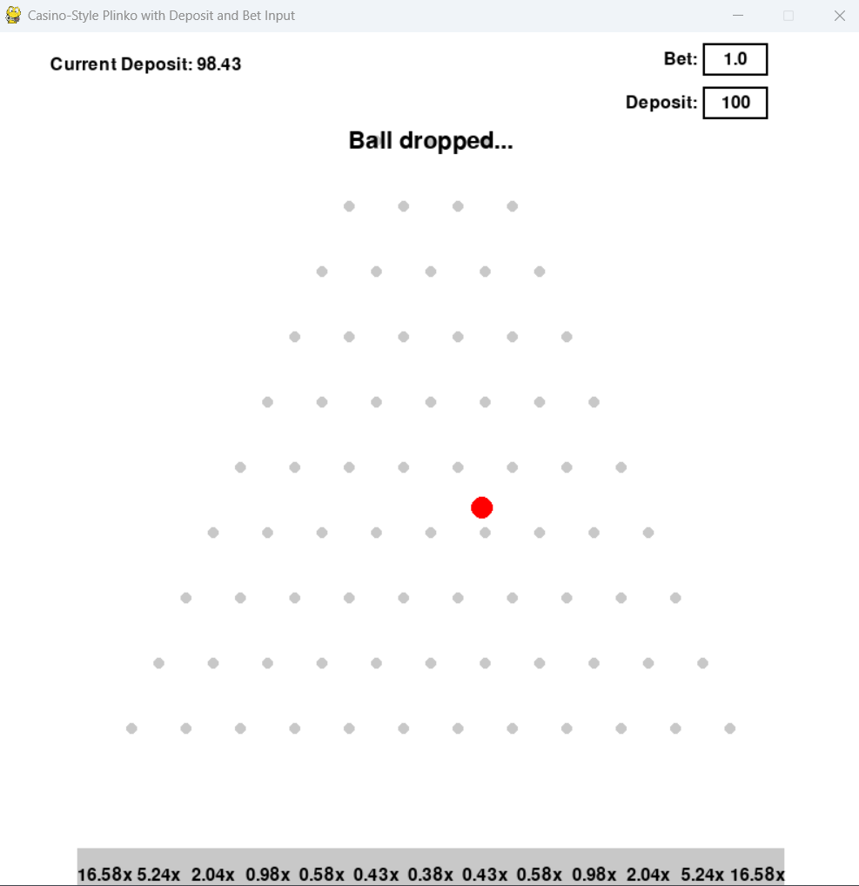

# Casino-Style Plinko Game

This is a casino-style Plinko game with a graphical interface using Python and Pygame. The game simulates dropping a ball through a triangular array of pegs, landing in one of several bins at the bottom. Each bin has a payout multiplier. The game’s expected value (EV) is set below 1.0 to ensure the house advantage remains intact, similar to a real casino machine.

## Features

- **Triangular Peg Layout:**  
  The board is arranged with a top row of 3 pins and each subsequent row having one additional pin, forming a triangular (Galton board-like) arrangement.
  
- **Customizable Bankroll and Bet:**  
  Players can input their total deposit amount and their desired bet size. Each time they drop the ball, the bet is deducted from the deposit. Any winnings are added back to the deposit.
  
- **Probability-Based Multipliers:**  
  The multipliers for each bin are determined by splitting a normal distribution into equal strips and assigning multipliers inversely proportional to the probability of landing in that strip. The multipliers are then scaled so that the overall expected return to player (RTP) is less than 100%.

- **Bouncy Visuals:**  
  The ball appears more "exciting" by visually bouncing after hitting pegs. This does not affect the underlying physics or the outcome distribution—just the visual presentation.

- **Intuitive UI:**  
  Users can easily update their deposit and bet amounts using on-screen input boxes. Pressing SPACE drops the ball and updates the deposit based on the result.

## How to Play

1. **Setup Deposit and Bet:**  
   - Click on the "Deposit" box at the top of the game window.
   - Type in how much money you want to deposit and press Enter.
   - Click on the "Bet" box and input your desired bet amount, then press Enter.
   
2. **Dropping the Ball:**  
   Make sure your deposit is at least as large as your bet. Press SPACE to drop the ball. The bet amount is immediately deducted from your deposit.

3. **Outcome:**
   The ball falls through the pegs. Where it lands at the bottom determines your winnings:
   - Each bin has a multiplier displayed on it.
   - Your winnings = (bet * multiplier).
   - Winnings are added to your deposit if the ball lands in a bin.
   - If the ball misses or results in a no-win bin, you simply lose the bet.
   
4. **Repeat:**
   Adjust your bet or deposit as desired and press SPACE to play again.



## Technical Details

- **Language and Library:**  
  The game is written in Python 3 using the Pygame library for graphics and user input.  
  To install Pygame:  
  ```bash
  pip install pygame
